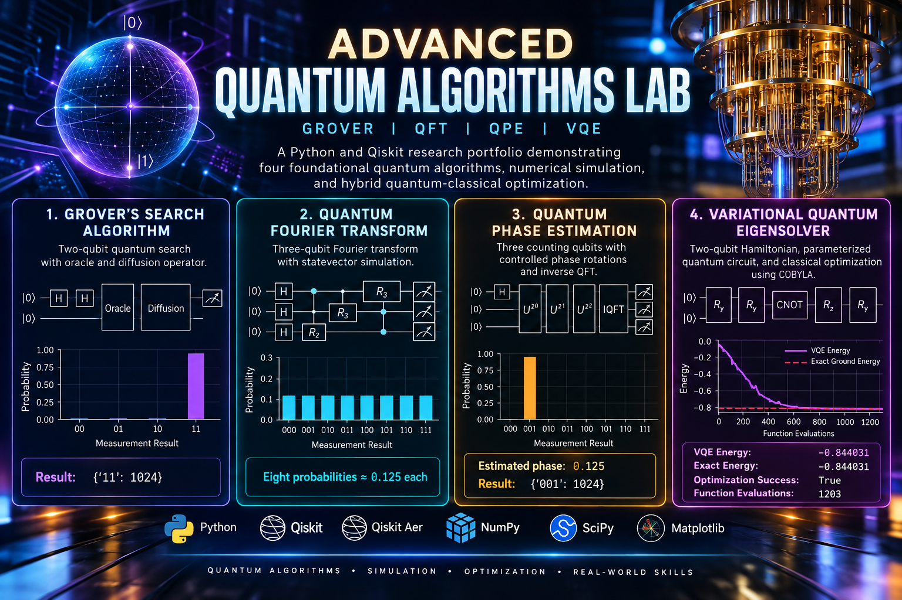
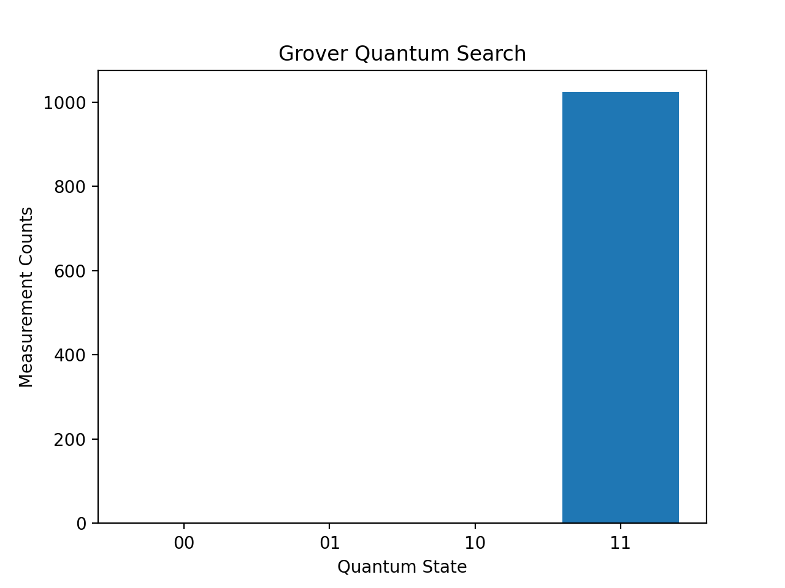
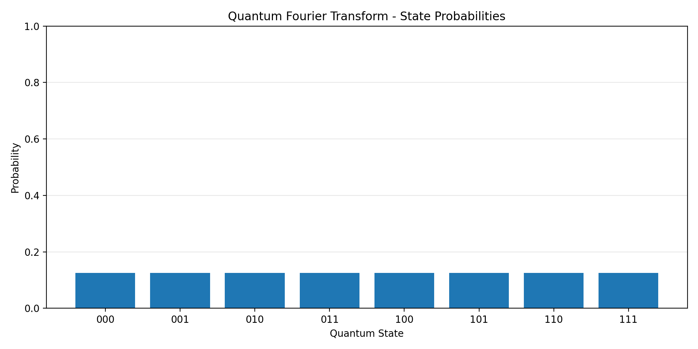
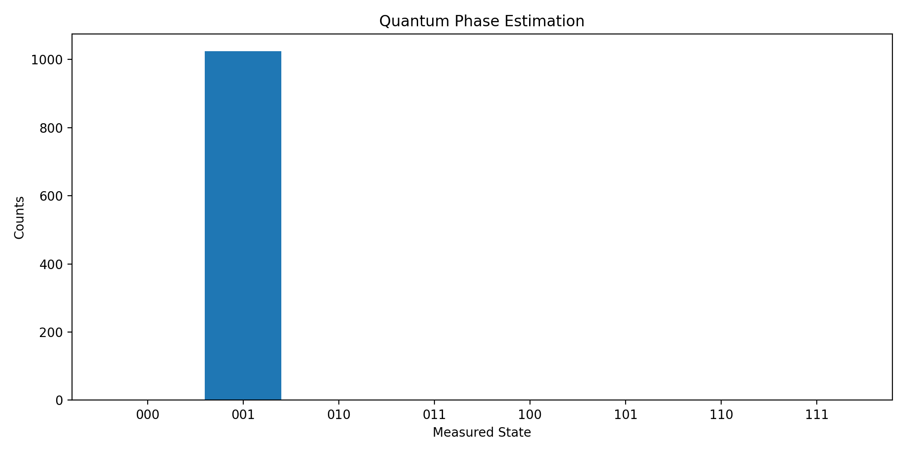
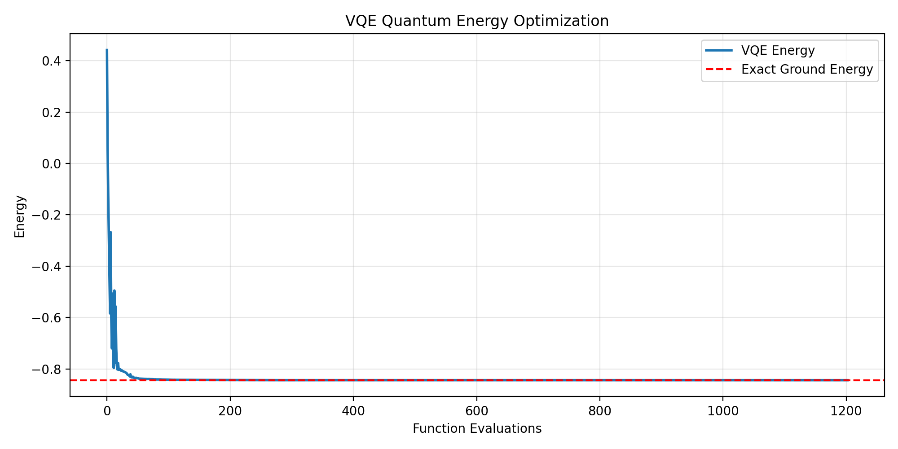

# Advanced Quantum Algorithms Lab

A Python and Qiskit research portfolio demonstrating four foundational quantum algorithms, numerical simulation, and hybrid quantum-classical optimization.

## Implemented Algorithms

### 1. Grover's Search Algorithm
- Two-qubit quantum search
- Oracle and diffusion operator
- Result: `{'11': 1024}`



### 2. Quantum Fourier Transform (QFT)
- Three-qubit Fourier transform
- Statevector simulation
- Eight measurement probabilities of approximately 0.125 each



### 3. Quantum Phase Estimation (QPE)
- Three counting qubits
- Controlled phase rotations and inverse QFT
- Estimated phase: 0.125
- Result: `{'001': 1024}`



### 4. Variational Quantum Eigensolver (VQE)
- Two-qubit Hamiltonian
- Parameterized quantum circuit
- Classical COBYLA optimizer
- Exact ground-state energy comparison

**Optimization results:**
- VQE Energy: -0.844031
- Exact Ground Energy: -0.844031
- Optimization Success: True
- Function Evaluations: 1203



## Technology Stack

- Python
- Qiskit
- Qiskit Aer
- NumPy
- SciPy
- Matplotlib

## Running the Simulations

Install the dependencies:

```bash
pip install qiskit qiskit-aer numpy scipy matplotlib
```

Run each algorithm:

```bash
python grover_search.py
python quantum_fourier.py
python quantum_phase_estimation.py
python vqe_optimizer.py
```

## Research Focus

Quantum algorithms, quantum circuit simulation, quantum phase estimation, variational methods, and hybrid quantum-classical computing.

## Project Status

All four algorithm demonstrations have been executed successfully in local simulation.